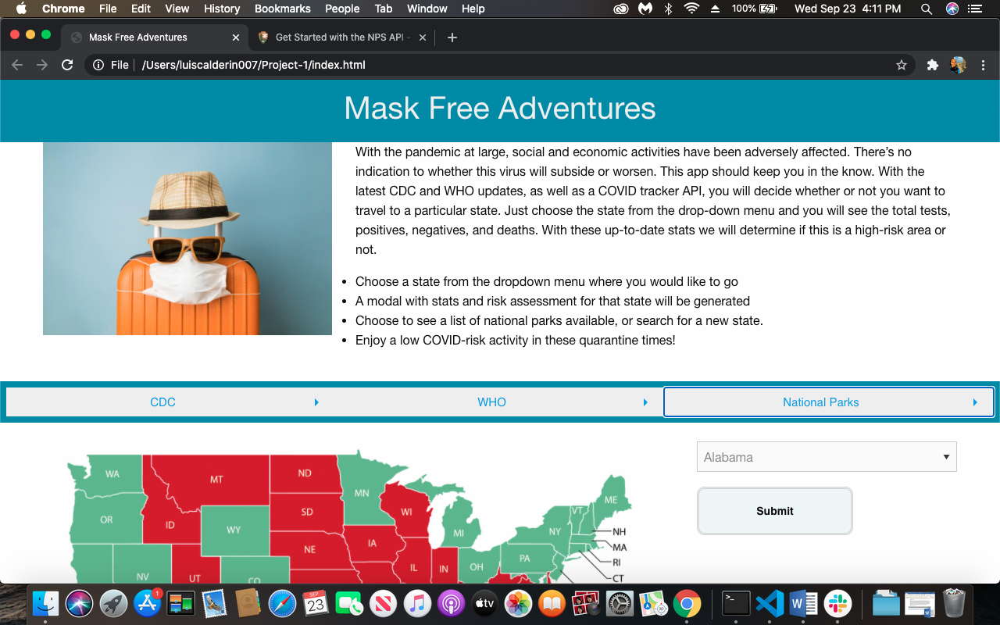
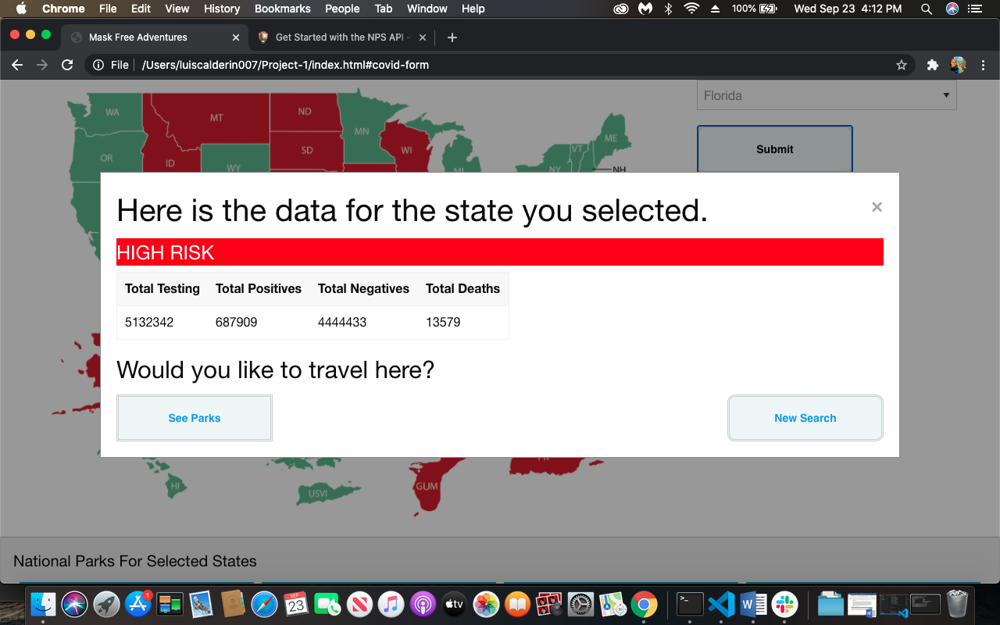
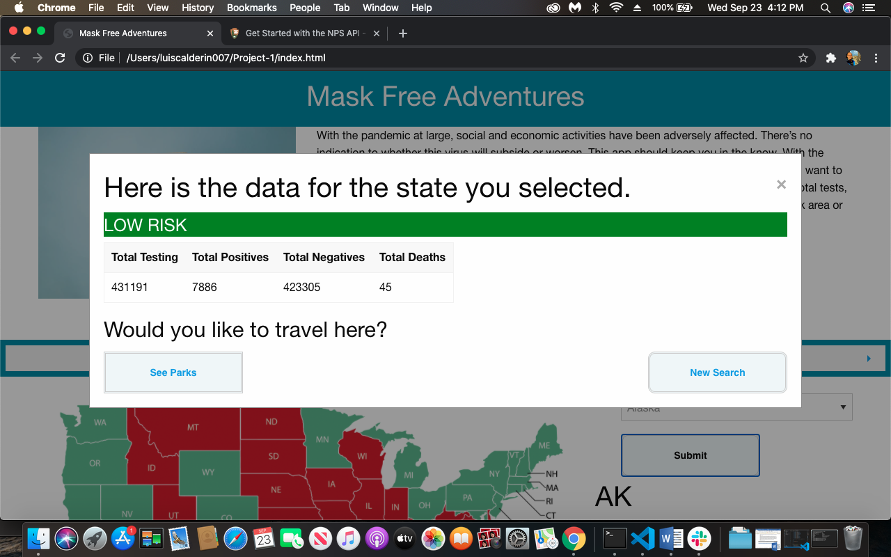
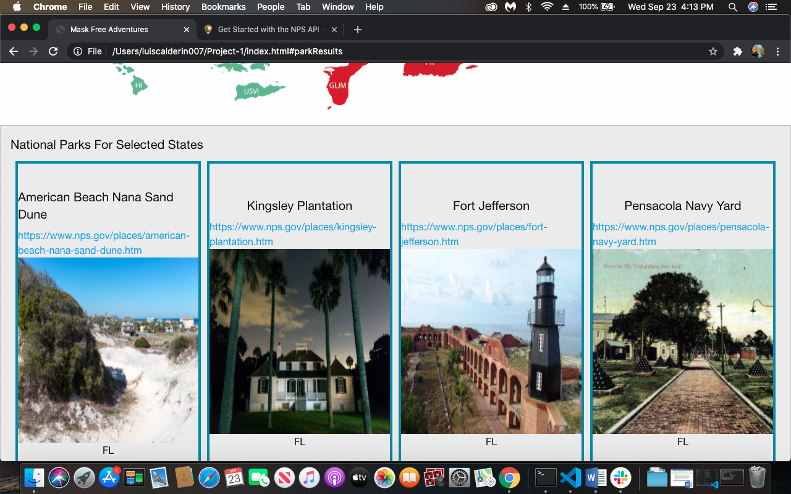

# Mask Free Adventures
 

## Links
[Repo Link](https://github.com/Elli360/Project-1)

 

 

## Team Codename

The Coding Covids
 

## Team Members 

Luis Calderin
 
Farrah Heath
 
Danielli Franquim
 

## Technologies Used
JQuery
 
Foundation HTML/CSS/JS Framework
 
The COVID Tracking Project  Data API
 
National Park Service Data API
 

## Overview

With the pandemic at large, social and economic activities have been adversely affected. There’s no indication to whether this virus will subside or worsen. This app should keep you in the know. With the latest CDC and WHO updates, as well as a COVID tracker API, you will decide whether or not you want to travel to a particular state. Just choose the state from the drop-down menu and you will see the total tests, positives, negatives, and deaths.  With these up-to-date stats we will determine if this is a high-risk area or not.
 
A display of local national parts will be displayed once a particular state is chosen. National parks are highly recommended for their inherently low transmissible rate. They provide large vacuous space where the six-feet rule could easily be accomplished. The profusion of UV light ( a covid killer) is another reason why these outdoor parks are so effective at reducing transmission. Consequently, providing weary travelers or quarantine-crazed individuals a safe and entertaining alternative the way nature intended.
 
Stay safe ladies and gents…
 

## User Story

AS A traveler
 
I WANT to see covid 19 statistics and optional national parks
 
SO THAT I can determine wether or not I want to travel to set destination
 

## Acceptance Criteria

GIVEN a dashboard with a dropdown menu
 
WHEN I search for a state
 
THEN I am presented with current coronavirus 19 data pertaining to that state
 
GIVEN a dashboard with a dropdown menu
 
WHEN I search for a state
 
THEN I am presented with national parks available to that state
 
GIVEN a risk assesment fromt the COVID API
 
WHEN the state is a high risk area
 
THEN I am presented with a modal displaying risk level
 

## Screenshots

 

 

 

